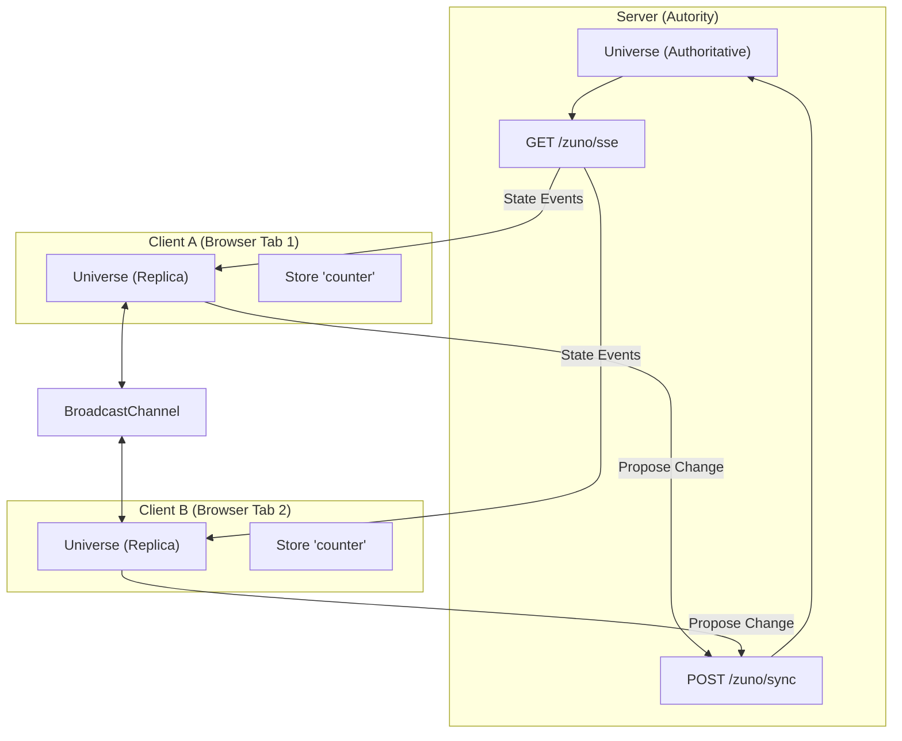

# Zuno Architecture

This document describes the high-level architecture of Zuno, its consistency model, and how state flows through the system.

## High-Level Overview

Zuno is a **distributed state engine**. It treats state as a replicated, versioned log rather than a local memory object.

## Core Components

### 1. Universe
The **Universe** is the top-level container. It manages a registry of **Stores**. In a distributed Zuno mesh, there is one *authoritative* Universe (usually on the server) and many *replica* Universes (in browser tabs or client processes).

### 2. Store
A **Store** is a keyed unit of state (e.g., `counter`, `user_session`). 
- Stores are **versioned**. Every state update increments the version number.
- Stores are **observable**. You can subscribe to changes.

### 3. Replicas
A replica is any participation point in the mesh. Replicas synchronize with the authoritative server to maintain a consistent view of the world.

---

## State Flow & Connectivity

### Transport Layers

Zuno uses a multi-layered transport strategy to balance latency and reliability:

1.  **SSE (Server-Sent Events)**: The primary downstream channel. The server streams authoritative state changes to all connected clients.
2.  **HTTP POST Sync**: The upstream channel. Clients "propose" state changes to the server.
3.  **BroadcastChannel**: A local optimization. Same-origin browser tabs share state updates directly to reduce server load and latency.

### Consistency Model: "Optimistic Convergent Consistency"

Zuno favors simplicity and predictability over complex conflict resolution like CRDTs.

1.  **Optimistic Update**: A client applies a change locally *immediately* and broadcasts it via `BroadcastChannel`.
2.  **Propose**: The client sends the change to the server via `POST /zuno/sync`, including the `baseVersion` it observed.
3.  **Validate**: The server checks if `baseVersion === currentVersion`.
    -   **Success**: The server increments the version, updates its authoritative state, and broadcasts the event via SSE.
    -   **Conflict (409)**: The server rejects the change and returns the *current* authoritative state.
4.  **Reconcile**: If a conflict occurs, the client rolls back (or merges) and must retry against the new authoritative state.

---

## Monorepo Structure

-   `packages/zuno`: The core state engine and sync primitives.
-   `packages/zuno-react`: React bindings (`useSyncExternalStore`).
-   `packages/zuno-express`: Server adapter for Node.js Express.
-   `packages/zuno-elysia`: Server adapter for Bun/Elysia.

## Technical Choices

-   **Why SSE instead of WebSockets?** SSE is simpler to implement, works over standard HTTP/1.1 and HTTP/2, is proxy-friendly, and naturally handles downstream-only streaming which fits 90% of state sync needs.
-   **Why versioning?** Versioning provides a clear "happen-before" relationship without needing vector clocks or complex timestamps.
