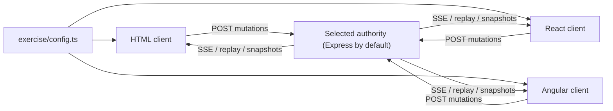

# Operations and Demo Topology

Zuno provides optimistic, server-authoritative eventual consistency with
version-based conflict detection. Local state can update immediately, but the
server's accepted version is authoritative and replicas converge through SSE
events, replay, or snapshot recovery.

## Run the complete demo

```bash
pnpm start
```

This single command starts all examples. The browser clients display connection,
queue, retry, and conflict state. Their authority is selected once in
`exercise/config.ts`; the default is the SQLite-backed Express service.



## Observable status

Every Zuno instance exposes `status.get()` and `status.subscribe(listener)`.
The snapshot contains `connection`, `queuedMutations`, `retryAttempt`,
`conflictCount`, and optional `lastError`.

## Structured telemetry

Pass `onLog` and `onMetric` to `createZuno`. Logs contain a stable event name,
level, timestamp, and structured details. Metrics contain a name, numeric value,
unit, timestamp, and optional tags. Hooks should enqueue work rather than block
the transport or throw.

## Changing the demo authority

Edit only `exercise/config.ts`:

```ts
export const ACTIVE_EXERCISE_SERVER = "express";
```

Choose `express`, `elysia`, or `http`, and change their ports in the adjacent
`EXERCISE_SERVER_PORTS` map. Restart the affected browser clients after editing.
